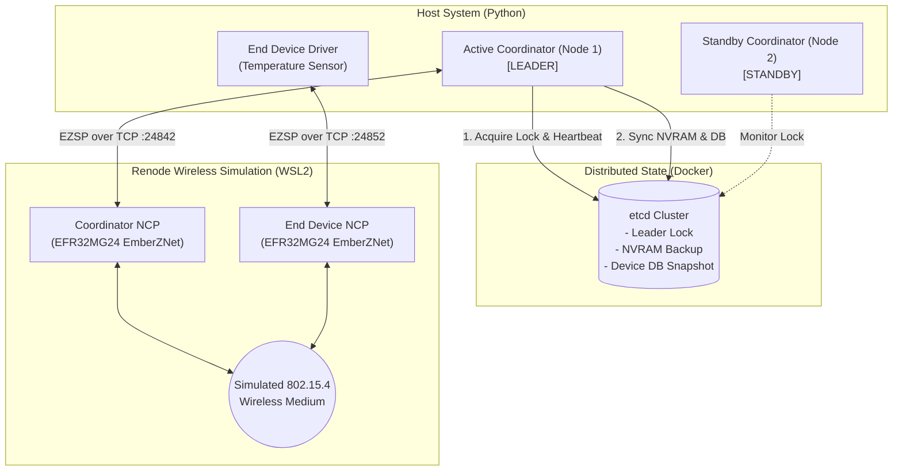
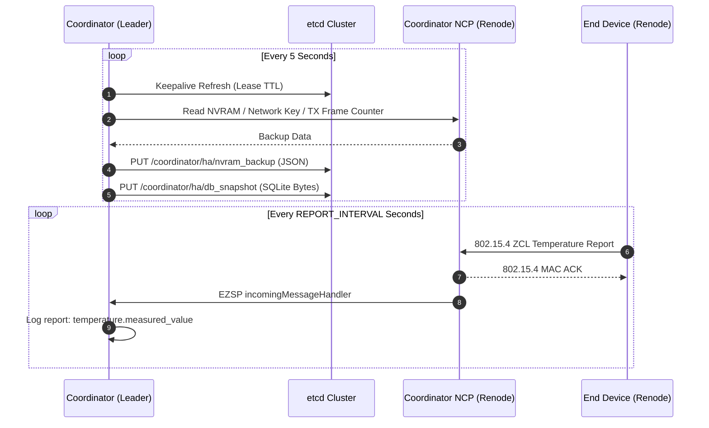
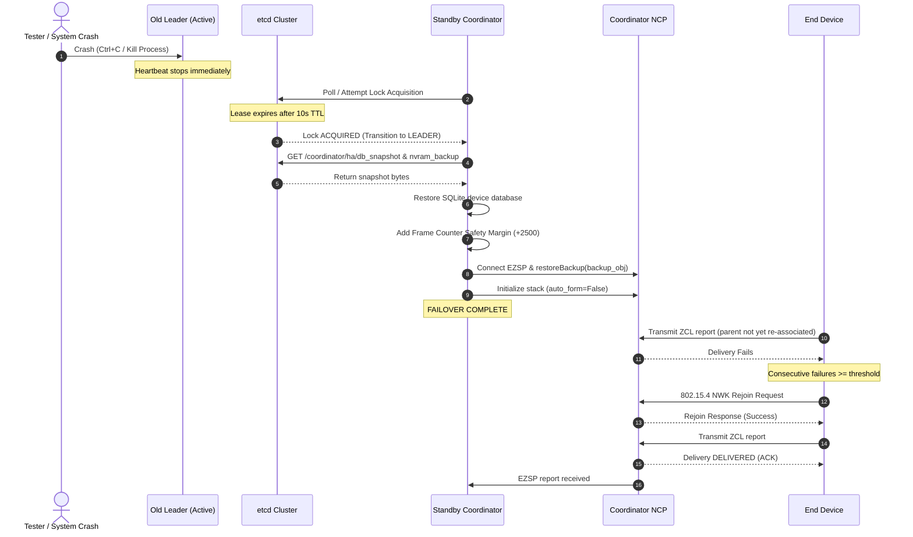

# Developer's Guide: High Availability Zigbee Coordinator

This document provides a technical overview of the system architecture, component modules, internal interactions, and tooling required to build, run, and extend the **High Availability (HA) Zigbee Coordinator with etcd**.

---

## 1. High-Level System Architecture

### 1.1 The Zigbee Coordinator Redundancy Challenge
In standard Zigbee networks (IEEE 802.15.4 / Zigbee 3.0), the Coordinator is a Single Point of Failure (SPOF). It acts as the **Trust Center**, retains the **Network Encryption Key**, tracks outgoing **cryptographic NWK frame counters** (to prevent replay attacks), and persists the **device pairing database**. If the coordinator fails, standard nodes cannot accept frames from a new coordinator using outdated frame counters, and new devices cannot join.

### 1.2 Our Architectural Solution
This project implements an **Active/Standby High Availability cluster** for Zigbee coordinators:
1. **Distributed Consensus (`etcd`)**: Provides distributed leader election using atomic TTL leases and keepalive heartbeats.
2. **Periodic State Synchronization**: The active leader periodically captures:
   - Zigpy Network Backup (NVRAM token state: PAN ID, Extended PAN ID, Channel, Trust Center Link Key, Network Key, and TX Frame Counter).
   - The SQLite device registration database (`zigbee_devices.db`).
   - Both are atomically stored into `etcd` under dedicated keys (`/coordinator/ha/nvram_backup` and `/coordinator/ha/db_snapshot`).
3. **Seamless Failover Recovery**: When the active leader fails:
   - Its etcd lease expires (~10 s).
   - The standby coordinator acquires the lock, retrieves the latest state, applies a **frame counter safety margin (+2500)** to prevent frame rejection, reconfigures the radio via EZSP, and resumes network operations without re-forming the network.
4. **Hardware Emulation via Renode**: Emulates two physical Silicon Labs EFR32MG24 microcontrollers running real EmberZNet NCP firmware over a simulated 802.15.4 wireless medium.



---

## 2. Directory & Module Overview

```text
├── src/
│   ├── coordinator.py           # Core HA Coordinator: election loop, state sync & failover
│   ├── radio.py                 # Radio abstraction layer (bellows vs. in-process mock)
│   ├── end_device_sim.py        # Simulated Zigbee End Device (EZSP client, reporting & rejoin)
│   └── mock_radio.py            # In-memory mock radio for lightweight development
├── sim/
│   ├── firmware/
│   │   └── mg24_ncp.out         # Silicon Labs EFR32MG24 EmberZNet NCP ELF binary (EZSP v13)
│   ├── renode/
│   │   ├── twonode.resc         # Renode orchestration script (two NCPs on virtual 802.15.4)
│   │   ├── brd4186c_userdata_mem.repl  # Platform variant with mapped user-data memory
│   │   └── make_userdata.py     # Generates flash user-data image with valid manufacturing tokens
│   ├── tools/
│   │   └── ash_test.py          # Standalone ASH/EZSP connection and handshake validator
│   ├── run_ncps.sh              # Headless Renode startup script inside WSL
│   └── setup_wsl.sh             # WSL Renode automated installation and setup script
├── docker-compose.yml           # Runs containerized etcd v3
├── requirements.txt             # Python libraries and dependencies
├── setup.bat                    # One-click environment bootstrap script for Windows
└── run.bat                      # One-click launch script orchestrating all components
```

### Module Descriptions

#### `src/coordinator.py`
The primary coordinator daemon. Key responsibilities:
- **Leader Election**: Manages an `etcd3` lock tied to a leased TTL (default 10s). Runs a background keepalive coroutine.
- **Data Sync Routine**: Periodically dumps the zigpy `NetworkBackup` (JSON serialized) and SQLite database bytes into `etcd`.
- **Failover Routine (`perform_failover`)**: On acquiring the lock, pulls NVRAM and DB snapshots from `etcd`, writes the database to disk, connects to the radio via `radio.py`, injects network keys with incremented frame counter, and initializes the radio without network re-formation.
- **Event Monitoring**: Attaches listeners (`ZigbeeEvents`) to monitor incoming cluster attribute reports and log joined devices.

#### `src/radio.py`
Abstracts radio hardware communication to decouple the coordinator logic from the underlying driver:
- Supports two backends:
  - `bellows`: Connects via TCP socket (`socket://127.0.0.1:24842`) to the Renode-simulated EFR32MG24 NCP using the EmberZNet Serial Protocol (EZSP).
  - `mock`: Uses `mock_radio.py` in-memory structures without external hardware/emulation dependencies.
- Handles startup differentiation: `start_fresh()` (forms a new network) vs. `start_restored()` (restores existing PAN, keys, and adjusted frame counter).
- Manages `FRAME_COUNTER_SAFETY_MARGIN = 2500` and provides `force_frame_counter()` to guarantee packet acceptance across failover.

#### `src/end_device_sim.py`
An autonomous Zigbee End Device script using the low-level `bellows.ezsp.EZSP` protocol directly:
- Connects to the second simulated NCP (`socket://127.0.0.1:24852`).
- Configures Zigbee 3.0 security (Trust Center Global Link Key: `ZigBeeAlliance09`).
- Scans for coordinator beacons, joins via MAC association, and binds endpoints (Basic and Temperature Measurement clusters).
- Transmits periodic ZCL attribute reports (`ZCL_REPORT_ATTRIBUTES`) and tracks delivery status.
- Implements an automated **Rejoin & Recovery State Machine**: if consecutive delivery failures exceed threshold (`FAILURES_BEFORE_REJOIN`), triggers `findAndRejoinNetwork` to re-establish child link with the newly elected coordinator.

#### `sim/` (Emulation Layer)
- **`firmware/mg24_ncp.out`**: Real EmberZNet NCP firmware built with Silicon Labs GSDK 4.4.1.
- **`renode/twonode.resc`**: Renode script setting up a shared `Medium.RadioMedium` (802.15.4 wireless air), two virtual `EFR32MG24` machines, UART emulators connected to TCP terminal servers, and scheduling hooks.
- **`tools/ash_test.py`**: Diagnostic utility for verifying the ASH UART framing protocol and EZSP version negotiation.

---

## 3. Basic Interactions & Data Flow

### 3.1 Steady-State Synchronization Flow


### 3.2 Failover Sequence Flow


---

## 4. Necessary Tools & Libraries

### 4.1 Host Dependencies
- **Python 3.11+**:
  - `zigpy` (>= 0.60.0): Core Zigbee stack and backup manager abstractions.
  - `bellows` (>= 0.38.0): Driver for Silicon Labs EmberZNet / EZSP radios.
  - `etcd3-py` (>= 0.1.6) / `grpcio`: Distributed consensus and key-value client.
  - `pyserial-asyncio`: Async serial communication driver.
  - `sqlite3`: Standard library SQLite integration for device storage.
- **Docker & Docker Compose**:
  - `quay.io/coreos/etcd:v3.5.9`: Containerized distributed consensus service.

### 4.2 Emulation & Firmware Tooling
- **Renode** (>= 1.15.3): Open-source multi-node hardware emulator from Antmicro supporting EFR32 Cortex-M33 emulation and 802.15.4 virtual radio media.
- **WSL2 (Ubuntu)**: Lightweight Linux container environment used on Windows to host the Renode execution.
- **Silicon Labs Simplicity Studio & Gecko SDK (GSDK 4.4.1)** *(Optional, for rebuilding firmware)*:
  - Project template: `zigbee_ncp_uart_hardware`.
  - Target Board: `BRD4186C` (EFR32MG24).
  - Protocol: EZSP v13.

---

## 5. Building, Extending & Modifying the Project

### Running in Lightweight Mock Mode
During logic or unit test development, you can completely bypass Renode and WSL by setting:
```cmd
set ZIGBEE_RADIO=mock
python src\coordinator.py
```
This activates `src/mock_radio.py`, enabling fast iteration over election and data sync logic.

### Modifying the Simulated End Device
To simulate additional Zigbee clusters (such as On/Off, Humidity, or Electrical Measurement):
1. In `src/end_device_sim.py`, define additional cluster IDs (e.g., `ON_OFF_CLUSTER = 0x0006`).
2. Register the cluster in `addEndpoint(..., inputClusterList=[BASIC_CLUSTER, TEMPERATURE_CLUSTER, ON_OFF_CLUSTER])`.
3. Construct the corresponding ZCL payload using `zcl_header(...)` and dispatch via `self.send(CLUSTER_ID, payload)`.

### Adjusting Failover Timing Parameters
- **Lease TTL**: In `src/coordinator.py`, change `self.etcd.lock(..., ttl=10)` to tune crash detection latency.
- **Sync Frequency**: In `src/coordinator.py`, adjust `await asyncio.sleep(5)` inside `data_sync_routine()` to change backup intervals.
- **Safety Margin**: In `src/radio.py`, `FRAME_COUNTER_SAFETY_MARGIN` (default 2500) can be tuned depending on network throughput to guarantee frame continuity.
